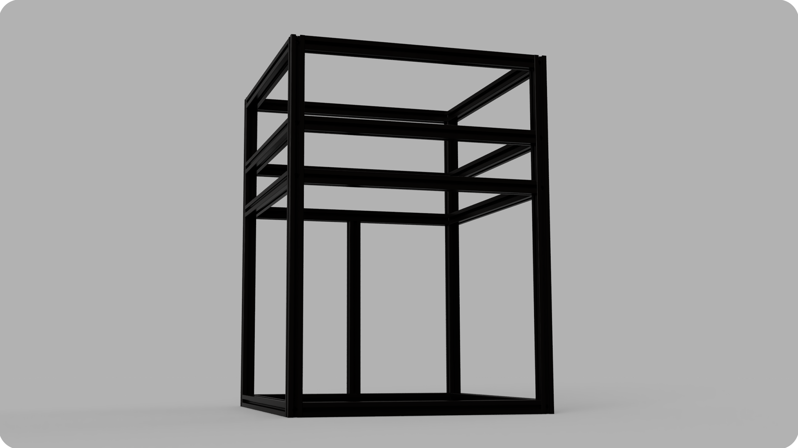
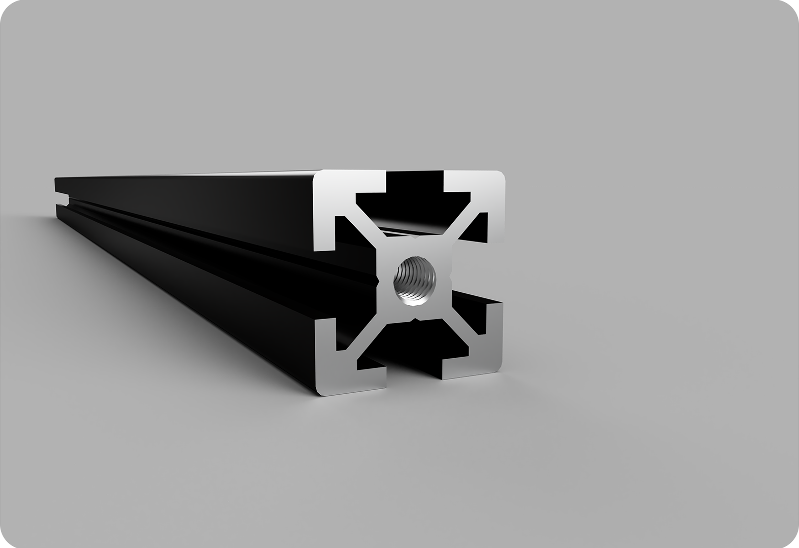

# 1. Frame Assembly

## Overview
After completing this guide, your printer's frame will be ready for assembling the gantry and z-axis. Be patient and enjoy the assembly process!

:::tip 
Build the printer on flat surface and use try square or similar to align the corners.
:::

### Required Stuff

<table>
  <thead>
    <tr>
      <th>Material</th>
      <th>Quantity</th>
      <th>Notes</th>
    </tr>
  </thead>
  <tbody>
    <tr>
      <td>M6/M5x16mm Roundhead Bolts</td>
      <td>34x</td>
      <td>Depending on the profile type, you may need to use M5 or M6 bolt.</td>
    </tr>
    <tr>
      <td>M6/M5 Tap</td>
      <td>1x</td>
      <td>Depending on the profile type, you may need to use M5 or M6 tap.</td>
    </tr>
        <tr>
      <td>M4x10mm Sockethead Bolts</td>
      <td>8x</td>
      <td>For the corner joints.</td>
    </tr>
        <tr>
      <td>M4 T-Nut</td>
      <td>8x</td>
      <td>For the corner joints.</td>
    </tr>
    <tr>
      <td>3.5mm/4mm Hex Key</td>
      <td>1x</td>
      <td>Depending on the profile type, you may need to use a 3.5mm or 4mm hex key.</td>
    </tr>
        <tr>
      <td>Corner Joint</td>
      <td>4x</td>
      <td>The corner joint attaches the extrusion that holds the middle Z-rail.</td>
    </tr>
    <tr>
      <td>625ZZ</td>
      <td>3x</td>
      <td>The bearings to be used in the guide.</td>
    </tr>
    <tr>
      <td> <a href="https://github.com/Pole-Engineering/Crossant-235/tree/main/STLs/Tools" target="_blank" rel="noopener noreferrer">3D Printed Guide</a> </td>
      <td>1x</td>
      <td>3D Printed guide for drilling positions.</td>
    </tr>

  </tbody>
</table>

### Frame Dimensions

<table>
  <thead>
    <tr>
      <th>Colors</th>
      <th>Dimensions</th>
    </tr>
  </thead>
  <tbody>
    <tr>
      <td><strong style={{ color: "#c30d0d" }}>Red</strong></td>
      <td>530mm</td>
    </tr>
    <tr>
      <td><strong style={{ color: "#0090ff" }}>Blue</strong></td>
      <td>350mm</td>
    </tr>
    <tr>
      <td><strong style={{ color: "#078901" }}>Green</strong></td>
      <td>300mm</td>
    </tr>
  </tbody>
</table>

 ## 1.1 Blind Joint
 > - a) You'll need to drill and tap the necessary holes for the blind joints. You can utilize the jig provided to you on [Github](https://github.com/Pole-Engineering/Crossant-235/tree/main/STLs/Tools) to ensure the holes are drilled in the correct positions.
 >
 > - Holes should be drilled on the 530mm extrusions at positions **10mm, 125mm, and 200mm** from the top and **10mm** from the bottom of the extrusion.
 >
 >
 >
 >
 >
 > - b) You need to tap both ends on all of the 350mm extrusions.
 >
 >
 >
 > - c) Screw the bolt into the tapped holes (approximately 10mm.)
 >
 >
 >
 >- d) Finally, Slide the extrusion onto the bolt and tighten it through the predrilled hole.  
 >
 >:::caution 
 >Tightening the bolts excessively can potentially damage the threads.
 >:::
 >
 >

 ## 1.2 Assembly Process
> Here, we begin assembling the frame. Please pay careful attention to the steps.
> 
> ### Step 1
> - First, you need to attach the lowermost extrusions to the vertical ones using blind joints. [(See 1.1)](/docs/assembly-guide/crossant/frame/#11-blind-joint)
>
> 

> ### Step 2
> - Secure the extrusion that will support the middle Z-rail using corner brackets.
> - The extrusion should be centered right beneath the bottom profile. (175mm from both side)
> 
> 
 

> ### Step 3
> - Finally, slide the other 350mm extrusions from the top into the slots of the 530mm extrusions and tighten the blind joints. The distances should be (from the bottom, face to face): 300mm, 55mm and 95mm.  
> - Don't forget to add 2 more corner brackets for the middle Z-rail holder extrusion to secure to the upper extrusion.
> 
> 
>
 
 ## You've Done It!
  Congratulations, you have successfully assembled the frame. You can now proceed with the gantry and z-axis assembly process.