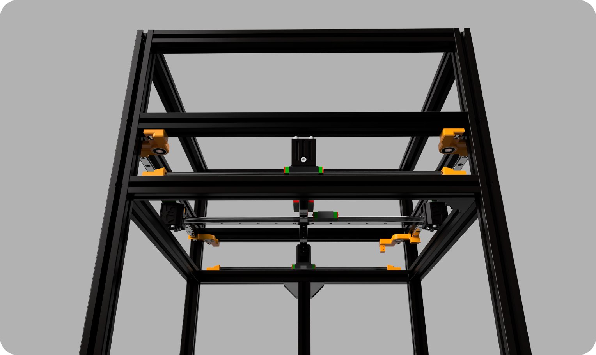

# 2. Gantry Assembly
## Overview
You've probably reached the most challenging part, the gantry assembly. Once we get through this stage, there isn't much left to do!

### Required Stuff

<table>
  <thead>
    <tr>
      <th>Material</th>
      <th>Quantity</th>
      <th>Notes</th>
    </tr>
  </thead>
  <tbody>
    <tr>
      <td>M4x8mm Roundhead Bolts</td>
      <td>24x</td>
      <td>The bolts for securing the shears, rail ends to frame. Also be used for clamping the rail.</td>
    </tr>
    <tr>
      <td>M4x20mm Roundhead Bolts</td>
      <td>24x</td>
      <td>The bolts for attach the motor mounts to frame.</td>
    </tr>
    <tr>
      <td>M3x8mm Sockethead Bolts</td>
      <td>28x</td>
      <td>The bolts for fixing the rails to frame.</td>
    </tr>
    <tr>
      <td>M3x35mm Sockethead Bolts</td>
      <td>16x</td>
      <td>The bolts for fixing the XY Joints to the rail blocks.</td>
    </tr>
    <tr>
      <td>M3x25mm Sockethead Bolts</td>
      <td>20x</td>
      <td>The bolts for tensioners and motors.</td>
    </tr>
    <tr>
      <td>M4 Hammerhead T Nut</td>
      <td>44x</td>
      <td></td>
    </tr>
      <tr>
      <td>M3 Hammerhead T Nut</td>
      <td>28x</td>
      <td></td>
    </tr>
     <tr>
      <td>M5 Washer </td>
      <td>4x</td>
      <td></td>
    </tr>
      <tr>
      <td>M4 Nut</td>
      <td>4x</td>
      <td></td>
    </tr>
    <tr>
      <td>M3 Nut</td>
      <td>4x</td>
      <td></td>
    </tr>
    <tr>
      <td>MGN9H 300mm Rails</td>
      <td>4x</td>
      <td>Fixed rails.</td>
    </tr>
     <tr>
      <td>MGN12C 350mm Rails</td>
      <td>2x</td>
      <td>Crossed rails.</td>
    </tr>
     <tr>
      <td>GT2 10mm XXXmm Length</td>
      <td>4x</td>
      <td></td>
    </tr>
     <tr>
      <td>GT2 10mm 5mm ID Pulley </td>
      <td>4x</td>
      <td></td>
    </tr>
    <tr>
      <td>GT2 10mm 5mm ID Idler </td>
      <td>4x</td>
      <td></td>
    </tr>
    <tr>
      <td>5mm OD 70mm Length Shaft </td>
      <td>4x</td>
      <td></td>
    </tr>
     <tr>
      <td>5x5mm Clamp Coupling </td>
      <td>4x</td>
      <td>For fixing the 70mm shaft to the motor shaft.</td>
    </tr>
    <tr>
      <td>625ZZ</td>
      <td>8x</td>
      <td>Shaft support bearings.</td>
    </tr>
    <tr>
      <td>OMC 2004s1</td>
      <td>4x</td>
      <td>Stepper motors.</td>
    </tr>
       <tr>
      <td><a href="https://github.com/Pole-Engineering/Crossant-235/blob/main/STLs/Gantry/xy_motor_mount_x4.stl" target="_blank" rel="noopener noreferrer">Motor Mounts</a></td>
      <td>4x</td>
      <td>3D Printed motor mounts.</td>
    </tr>
       <tr>
      <td><a href="https://github.com/Pole-Engineering/Crossant-235/blob/main/STLs/Gantry/%5Ba%5D_top_shear_x4.stl" target="_blank" rel="noopener noreferrer">Top Shears</a></td>
      <td>4x</td>
      <td>3D Printed top shaft support.</td>
    </tr>
      <tr>
      <td><a href="https://github.com/Pole-Engineering/Crossant-235/blob/main/STLs/Gantry/%5Ba%5D_bottom_shear_x4.stl" target="_blank" rel="noopener noreferrer">Bottom Shears A</a></td>
      <td>4x</td>
      <td>3D Printed bottom shaft support A.</td>
    </tr>
     <tr>
      <td><a href="https://github.com/Pole-Engineering/Crossant-235/blob/main/STLs/Gantry/%5Ba%5D_bottom_shear_x4.stl" target="_blank" rel="noopener noreferrer">Bottom Shears B</a></td>
      <td>4x</td>
      <td>3D Printed bottom shaft support B.</td>
    </tr>
     <tr>
      <td><a href="https://github.com/Pole-Engineering/Crossant-235/blob/main/STLs/Misc/rail_stop_x10.stl" target="_blank" rel="noopener noreferrer">Rail Ends</a></td>
      <td>4x</td>
      <td>3D Printed rail ends.</td>
    </tr>
    <tr>
      <td><a href="https://github.com/Pole-Engineering/Crossant-235/blob/main/STLs/Gantry/xy_joint_x2.stl" target="_blank" rel="noopener noreferrer">XY Joints</a></td>
      <td>4x</td>
      <td>3D Printed XY-Joints.</td>
    </tr>
     <tr>
      <td><a href="https://github.com/Pole-Engineering/Crossant-235/blob/main/STLs/Gantry/joint_tensioner_x4.stl" target="_blank" rel="noopener noreferrer">Tensioners</a></td>
      <td>4x</td>
      <td>3D Printed tensioners.</td>
    </tr>
      <tr>
      <td><a href="https://github.com/Pole-Engineering/Crossant-235/blob/main/STLs/Gantry/joint_tensioner_x4.stl" target="_blank" rel="noopener noreferrer">2.5mm Spacers</a></td>
      <td>4x</td>
      <td>3D Printed 2.5mm spacers.</td>
    </tr>
     <tr>
      <td><a href="https://github.com/Pole-Engineering/Crossant-235/blob/main/STLs/Gantry/joint_tensioner_x4.stl" target="_blank" rel="noopener noreferrer">Coupling Mount Guide</a></td>
      <td>1x</td>
      <td>3D Printed coupling mount guide.</td>
    </tr>

  </tbody>
</table>

## 2.1 Assembly
> 
 > There are two distinct assemblies related to the positioning of pulleys and idlers, as well as differences in shear. (Motor Assembly A on the left, Motor Assembly B on the right)
 >
 > - You will be specified the common steps in both assemblies.
 >
 > 
 
### a) Coupling & Shaft
 > - First, secure the coupling to the motor shaft using the [3D printed coupling guide](https://github.com/Pole-Engineering/Crossant-235/blob/main/STLs/Gantry/joint_tensioner_x4.stl), and then push the 70mm shaft into the coupling as far as it can go and secure it.
 > - This step is common for both assemblies and repeat this process for 4 times.
 >
 > 

 ### b) Motor Mounts
 > - Now, you need to mount the stepper motor to the [motor mount](https://github.com/Pole-Engineering/Crossant-235/blob/main/STLs/Gantry/xy_motor_mount_x4.stl) using four M3x25mm bolts. Also, don't forget to prepare the M4x20 screws and T-nuts to secure the motor mounts to the frame.
 > - This step is common for both assemblies and repeat this process for 4 times.
 >
 > 
  
  ### c) Top & Bottom Shaft Supports
 > - Next, you need to prepare the top and bottom shaft supports. We press-fit 625ZZ or 625RS2 bearings into the 3D printed parts to ensure a secure fit. Also, don't forget to prepare the M4x8 screws and T-nuts to secure the motor mounts to the frame.
 > - This step is common for both assemblies and repeat this process for all the top and bottom shaft supports.
 >
 > 

   ### d) Fixed Rails
 > - Prepare the bolts and T-nuts that will be used to secure the rails to the frame, you need to first get them ready for installation
 > - You need to prepare all the 4 fixed rails.
 >
 > 
 > 
 > - Mount the rails to the locations shown in the lower photo, but do not tighten the bolts too much; we will adjust the exact positioning later.
 >
 >:::caution
 > - Mount the rails with carriage on it otherwise you wont be able to install the blocks.
 >
 > 
 >::: 
 >:::tip 
 Use rail centering tool.
   
   ### e) Cross Rails & XY-Joints 
   
 > - You're starting to prepare the XY joints, first by attaching the nut and bolt that will secure the rail in place by tightening it.
 > - Repeat this process for all the XY joints.
 >
 > 
 >
 > - Now you can place the rail in position, but fully tightening the bolt may make the assembly more difficult. Tighten the bolt that secures the rail, but not completely.
 >
 > 
 
 >:::caution
 > - To assemble the XY joints, you'll need to loosen and slide the extrusions marked in blue in the pictures below a bit.
 >
 > 
 >
 > - Frame should look like this before the XY Joints assembly.
 >
 > 
 >:::caution
 > - You can use M3x35mm screws to secure the XY joints to the rails.Also dont forget to mount the rail ends.
 >
 > 
 >
 >  - Now you can correct the extrusion positions.

  ### f) Shaft Supports and Motor Mounts Mounting
 > - We've come to assemble the shaft supports!
 > - As I mentioned in the [Motor Mounts](/docs/assembly-guide/crossant/gantry/#b-motor-mounts) section so pay attention to instructions.
 >
 > 
 >
 > - Mount the Top Shaft Support A to the front-left and rear-right, and Top Shaft Support B to the front-right and rear-left with using M4x8 bolts and T-Nuts, as specified.

