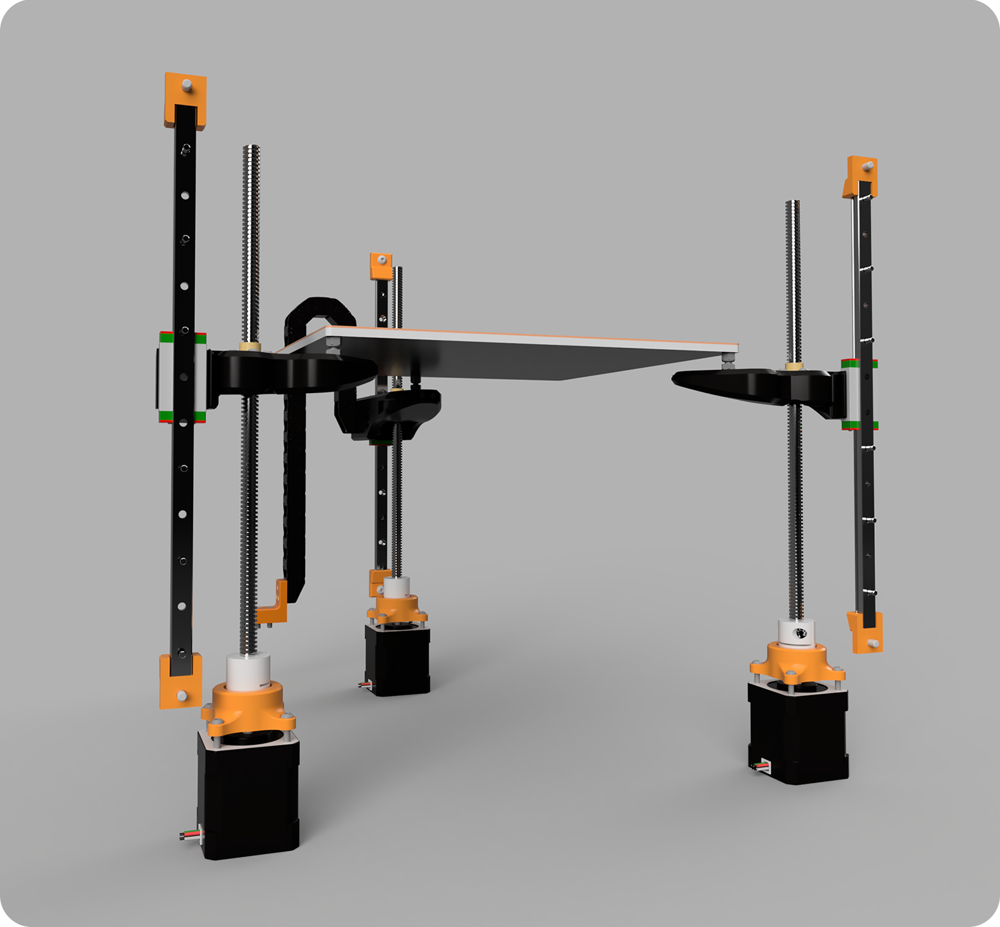
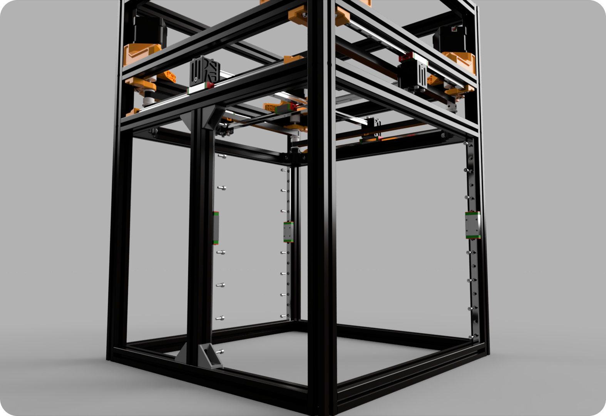

# 3. Z Axis Assembly

## Overview
After completing this section, you will have finished assembling all the axes.

### Required Stuff

<table>
  <thead>
    <tr>
      <th>Material</th>
      <th>Quantity</th>
      <th>Notes</th>
    </tr>
  </thead>
  <tbody>
    <tr>
      <td>M3x8 Sockethead Bolts</td>
      <td>18x</td>
      <td>For mounting the rails.</td>
    </tr>
    <tr>
      <td>M3 T-Nut</td>
      <td>18x</td>
      <td>For mounting the rails.</td>
    </tr>
        <tr>
      <td>M4x8 Sockethead Bolts</td>
      <td>6x</td>
      <td>For the rail ends.</td>
    </tr>
        <tr>
      <td>M4x12 Sockethead Bolts</td>
      <td>2x</td>
      <td>For dragchain mount.</td>
    </tr>
        <tr>
      <td>M3x12 Roundhead Bolts</td>
      <td>12x</td>
      <td>For mounting the motors to the bottom panel.</td>
    </tr>
    <tr>
      <td>M3x10 Sockethead Bolts</td>
      <td>1x</td>
      <td>For fixing the joints to the rails.</td>
    </tr>
        <tr>
      <td>M3x16 Roundhead Bolts</td>
      <td>12x</td>
      <td>For fixing leadscrew nuts to the joints.</td>
    </tr>
      <tr>
      <td>M3x6 Roundehead </td>
      <td>6x</td>
      <td>For fixing the dragchain.</td>
    </tr>
    <tr>
      <td>M4x16 Flathead Bolts</td>
      <td>4x</td>
      <td>For the heatbed.</td>
    </tr>
     <tr>
      <td>M3 Locknut</td>
      <td>12x</td>
      <td>For fixing leadscrew nuts to the joints.</td>
    </tr>
    <tr>
      <td>M4 Locknut </td>
      <td>4x</td>
      <td>3D Printed guide for drilling positions.</td>
    </tr>
     <tr>
      <td>M4 Round Nut </td>
      <td>4x</td>
      <td>Acts as a slider for the heatbed.</td>
    </tr>
     <tr>
      <td>50mm Rod OD4 </td>
      <td>6x</td>
      <td>Slider guide for heatbed.</td>
    </tr>
       <tr>
      <td>300mm T8 Leadscrew and Nut </td>
      <td>3x</td>
      <td>Leadscrew.</td>
    </tr>
       <tr>
      <td>5x8 Coupling </td>
      <td>3x</td>
      <td>Coupling that fixes leadscrews to the motor shafts.</td>
    </tr>
      <tr>
      <td>MGN9H 300mm </td>
      <td>3x</td>
      <td>Coupling that fixes leadscrews to the motor shafts.</td>
    </tr>
    

  </tbody>
</table>

## Assembly 
You can configure the printer with 3 different Z systems, but currently, only the assembly for the leadscrew Z version is available

### a) Mounting the Rails
>First, you need to attach the MGN9H 300mm rails, which will carry the Z-axis, to the frame using M3x8 socket head screws and M3 T-nuts.
>:::tip 
>Use the [rail centering tool](https://github.com/Pole-Engineering/Crossant-235) for proper installation.
>:::
>
>

### b) Preparing the Joints
>
>Now, you need to prepare the Z joints by following the steps below:
>
>- Insert OD4 50mm rods:
>Gently push the OD4 50mm rods inward from the front locations of the part. Be careful, as the part can crack.
>
>- Secure the T8 nut:
>Secure the T8 nut using 4 M3x15 screws and 4 locknuts. However, do not tighten the nuts all the way. The nuts should be able to move easily in both axes to eliminate Z > wobble.
>
>
>
>- It should look like this after assembly.
>
>