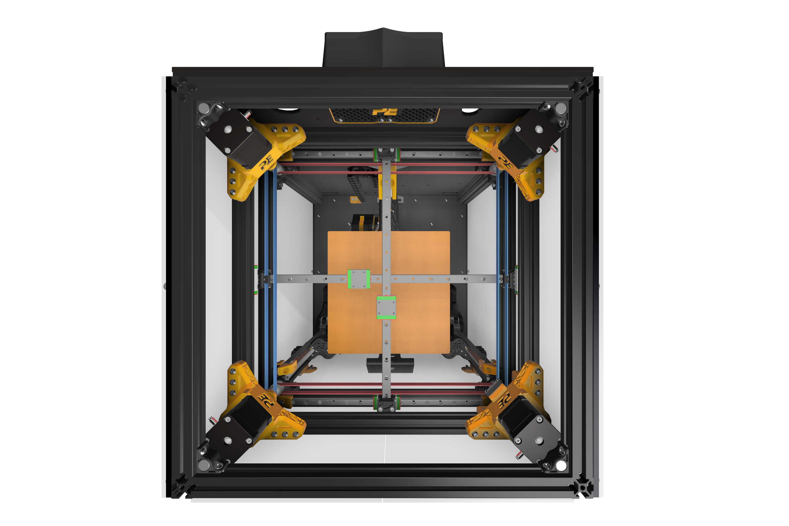

# Belts

>The Crossant has a total of four belts to facilitate XY movement. Two of these belts control the X-axis, while the other two control the Y-axis.
>
>In the image below, the belts shown in blue are the Y belts, while those shown in red are the X belts. It is crucial for the print quality that all four of these belts have the same tension. Now, let's talk a bit about belt tensioning.
>
>

## Belt Tensioning
>Regardless of the type of printer you use, belt tension plays a significant role in your printer's performance. On this page, we will explain how tight the belt should be, how to measure the tension, and what can happen if the belt tension is too low or too high.

### How Much Tension to Apply
>There are several different ways to measure belt tension: applied force (lbs) and the belt's physical tension (Hz). The lbs value can vary depending on the type of belt you use (GT2, GT3, HTD3M) and may yield different lbs values at different Hertz. However, since we use a GT2 10mm belt on our Crosant, we will proceed based on that.
>
>For a GT2 10mm belt, the value recommended by Gates in lbs is XX. However, we tension the belts at a value 1.5-2 times higher than these recommended values. The gantry belts on the Crosant are 762mm long, and the length of the belt between the pulley and the idler is approximately 270mm, which we refer to as the full span. The recommended belt tension for the Crosant is in the range of 100-110 Hz at full span.

### How to Measure?
>Since we measure in HZ, we won't go into lbs measurements. There are two options for measuring in Hz. The first is to use a tuning app that you can download to your phone, and the second is to use a physical tuning device. Both work in the same way. The measurement process is as follows: after ensuring a quiet environment, pluck the middle point of the belt at full span as if you were playing a guitar string, and then hold the phone close to the belt to measure the sound frequency emitted by the belt.