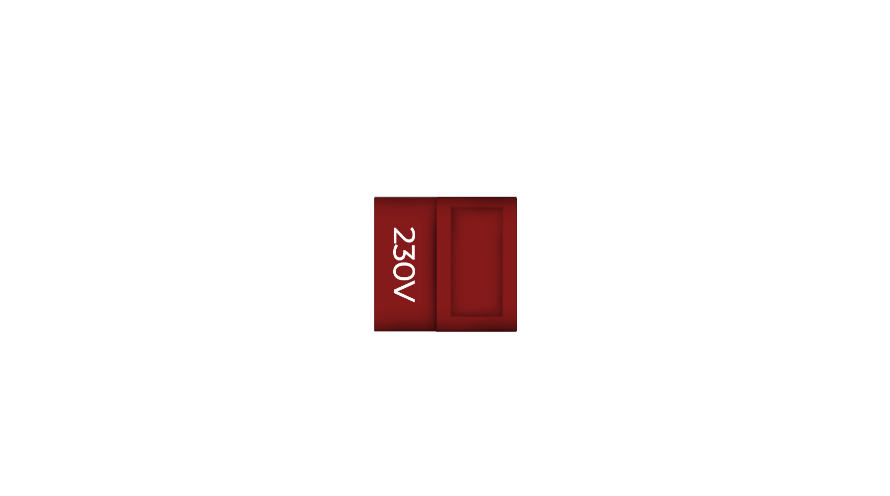

import mobo from '/static/img/mobo.png';
import can from '/static/img/can.png';
import sbc from '/static/img/sbc.png';
import cm4 from '/static/img/cm4.png';


# Electronics

>When building a 3D printer, the electronics stage is where you are most likely to make mistakes. On this page, we will provide you with the necessary information to avoid harming yourself and your electronics.

## Power Supplies

### PSU Selection
>To get the printer up and running, a single 24V PSU is sufficient. However, if you want to push the limits, you can use a 48V PSU with TMC5160 drivers to allow your motors to deliver their maximum RPM and torque over a wider range. Additionally, to connect extra accessories like Neopixels or LED strips, you can add 5V and/or 12V PSUs to your printer
>
>We recommend using original Meanwell PSUs. The printer's PSU mounts are designed to be compatible with the LRS series. The LRS350-24 and LRS350-48 have power capacities that are quite sufficient for the printer.
>:::caution
You can use PSUs with lower wattage values, but drawing power close to the PSU's limits increases risk and shortens the lifespan of the PSU.
:::

### Voltage selection
>:::danger
PSUs have a switch to toggle between 115V and 230V. It is crucial to set this switch to correct AC voltage rate.
- If you select 230V in countries with 115V, your PSU will operate below its potential.
- If you set 115V in countries with 230V, your PSU will destroy itself. (literally💥)

>



## AC Heatbed
>If you're using an AC heatbed, it's essential to use an SSR (Solid State Relay). Due to many counterfeit SSRs on the market, we recommend ensuring you purchase genuine, original SSRs to avoid potential issues.

## Wires Color Charts
### AC Wires Color Chart
>In different parts of the world, different colors are preferred for AC voltage wiring. Below is a list showing which colors are used based on your country and region.
> :::danger
Being exposed to AC electricity is extremely risky for your health. When working with AC voltage, absolutely avoid touching the wires.
:::
>
>| Wire & cable   | US/Canada                   | Europe & UK   | China & Russia | Oceania       | Japan         | India         |
| -------------- | --------------------------- | ------------- | -------------- | ------------- | ------------- | ------------- |
| Live / Line    |   |  |  |   |  |  |
| Neutral        |    |   |  | |  |  |
| Ground / Earth |   |  |   |  |  |  |


### DC Wires Color Chart
>Generally, worldwide for DC voltage, red is used for the positive line (+) and black for the negative line (-). However, since we have multiple voltage lines in our use, we can create a color coding scheme as listed below:
>
>| Potential | Colour                        | Note                                |
| --------- |  ----------------------------- | ----------------------------------  |
| Ground    |      |                   |
| 5V        |          |                   |
| Signals   |      | For signals such as limit switches, neopixels etc.           |
| 12V       |       | You can use red wires but suggesting you to use something different than other voltage rails.                                    |
| 24V       |           | You can use red wires but suggesting you to use something different than other voltage rails.                                    |
| 48V       |    | Use a different color than the one you used for 12V and 24V.  |

## Wire Gauges
>The table that specifies the cable cross-sections you need to use for different voltage lines in the printer is provided below.
>:::danger
The thickness of the cables you use should be suitable for the current they will carry. If you attempt to exceed the maximum current rating of a cable, it can overheat and melt over time, potentially causing a fire. Always ensure that the current passing through your cables does not exceed their rated amperage.
:::
>
| Application    | AWG     | Metric   |
| -------------- | ------- | -------- |
| DC Bed Heater  | 16 AWG  | 1.50 mm² |
| AC Line        | 18 AWG  | 1 mm²    |
| Hotend Heater  | 20 AWG  | 0.50 mm² |
| Steppers       | 22 AWG  | 0.34 mm² |
| Signal wires   | 24 AWG  | 0.25 mm² |

# Mainboard Selection
>Since the Crossant has a total of 8 motors, you should choose a mainboard with 8 driver slots. Alternatively, you could use two mainboards with fewer than 8 driver slots, but we do not recommend this.
>
>Since we aim for high speeds, you may prefer the STM32F446 chip. However the H729, have much higher MHz values compared to the F446 and F429, making them more suitable for a fast printer. Otherwise, you may encounter the ```MCU timer too close``` error.
>
><div style={{textAlign: 'center'}}>
  
  </div>

# Canboards
>Although CAN boards simplify toolhead wiring, they are likely to cause several problems. The biggest issue is their inability to withstand high chamber temperatures. Therefore, we do not recommend CAN boards for printers with a chamber, such as the Crossant.
>
><div style={{textAlign: 'center'}}>
  
  </div>

  # SBCs (Single Board Computers)
>An SBC (Single Board Computer) is a simple computer that, when you install Klipper on it, allows you to control the printer. You can use models like Raspberry Pi, Orange Pi, and Banana Pi, but if you use SBCs specifically designed for this purpose, like the BTT Pi, you'll have more options as a source.
>
>
><div style={{textAlign: 'center'}}>
  
  </div>
>
>:::info
If you are using the BTT Manta mainboard, you can use SBCs produced by BTT, such as the CB1, CB2, or even the Raspberry Pi CM4, which can be easily mounted on the Manta.s
<div style={{textAlign: 'center'}}>
  
  </div>
:::
