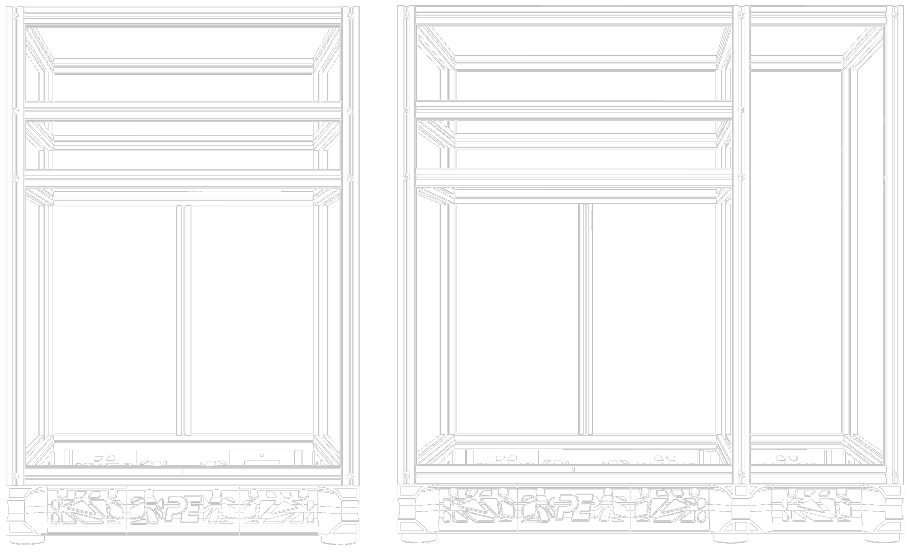

import frame from '/static/img/frames.png';

# Frame
>The frames must be assembled perfectly parallel to each other, as this plays a crucial role in the performance of the printer. On this page, we will discuss the two different frame options supported by the Crossant, the assembly methods (blind joint, corner bracket), and the tools you will need.

# Frame Selection
>Crossant offers two different frame options: Sidepack and Default. You can click [here](../Configurations.md#default-frame-vs-sidepack-frame) to see the advantages and disadvantages of each frame compared to the other.

<!--  -->

  
  

